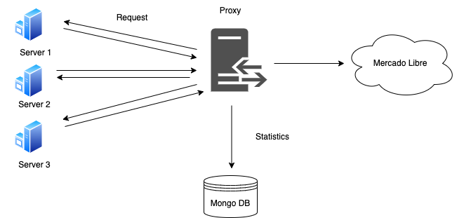
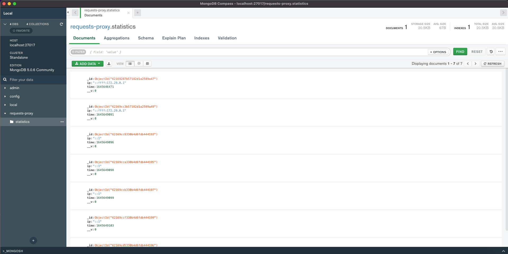
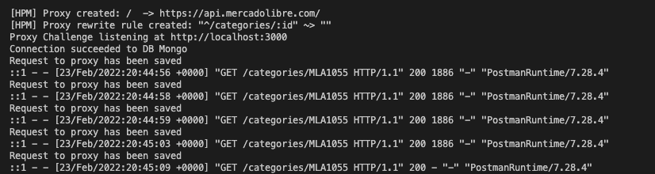

# Meli Proxy Challenge

API Proxy developed for the Mercado Libre challenge.

## Getting Started

These instructions will get you a copy of the project up and running on your local machine for development and testing purposes.

### Prerequisites

https://www.docker.com/get-started

### Usage

#### Development Profile

Run in the command line:
```
docker-compose up -d --build
```

Test the proxy:
```
curl http://localhost:80/categories/MLA1055
```

## Solution diagram



## Statistics

### History

Proxy usage statistics



### Logging

Collect metrics about the requests processed by the API gateway




## Built With

* [Node.js](https://nodejs.org/en/) - Backend framework used
* [MongoDB](https://www.mongodb.com/) - Database used

## Author

* **Freddy Alexander Morales**